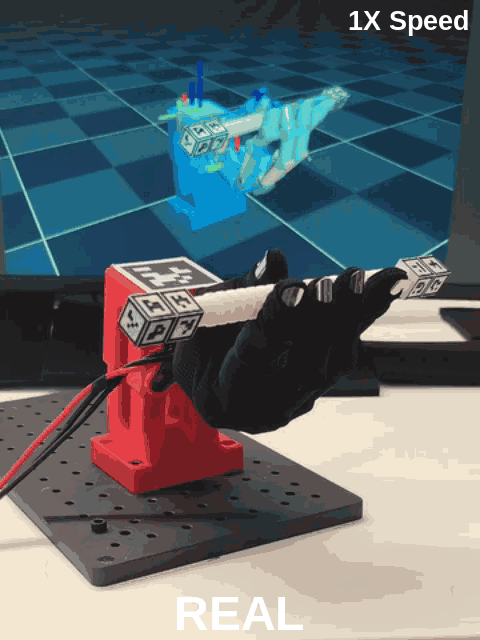

# wuji-mjlab

[English version](README.md)

[](https://opensource.org/licenses/Apache-2.0)
[](https://github.com/wuji-technology/wuji-mjlab/releases)
[](https://www.python.org/downloads/)
[](https://pytorch.org/)
[](https://developer.nvidia.com/cuda-toolkit)
[](https://github.com/wuji-technology/wuji-mjlab/stargazers)

> Wuji Hand 灵巧操作：基于 mjlab 和 PPO，支持 Wuji Hand 1、Wuji Hand 2 的方块手内翻转，以及 Wuji Hand 2 的参考动作跟踪转笔，并提供真机闭环部署。

## 视频展示

<table width="100%">
  <tr>
    <td width="32%" valign="top"><a href="src/wuji_mjlab/tasks/reorient/docs/assets/sim_labeled.gif"></a><br /><a href="src/wuji_mjlab/tasks/reorient/docs/assets/real_labeled.gif"></a></td>
    <td width="32%" valign="top"><a href="src/wuji_mjlab/tasks/reorient/docs/assets/sim_hand2_labeled.gif"></a><br /><a href="src/wuji_mjlab/tasks/reorient/docs/assets/real_hand2_labeled.gif"></a></td>
    <td width="36%" valign="top"><a href="src/wuji_mjlab/tasks/pen_spin/docs/assets/clip3_labeled.gif"></a></td>
  </tr>
</table>

左列：**Wuji Hand 1 转方块**。中列：**Wuji Hand 2 转方块**。两列均为**上方仿真、下方真机**。右列：**Wuji Hand 2 第 3 组转笔**。五段视频均以 **1X Speed** 独立循环播放；点击各自画面可放大。

## 环境要求

- Linux x86_64
- NVIDIA GPU，CUDA 12.8（支持 Blackwell sm_120 / RTX 50 系列）
- [pixi](https://pixi.sh) ≥ 0.72 —— **唯一支持的安装方式**

> ⚠️ **注意**：本仓库**仅支持 pixi**。`conda + pip install -e .` 未经测试且不受支持。

## 安装

```bash
# 1. 安装 pixi（仅需一次）
curl -fsSL https://pixi.sh/install.sh | bash
export PATH="$HOME/.pixi/bin:$PATH"

# 2. 克隆仓库并安装训练环境
git clone https://github.com/wuji-technology/wuji-mjlab
cd wuji-mjlab
pixi install

# 3. 验证安装，列出已注册任务
pixi run list-envs
```

`pixi install` 创建训练与回放共用的 `default` 环境。安装后，从下方任务入口继续准备数据和启动训练；各任务的部署环境安装方法见对应任务文档。

## 任务

[v2026.9.27 发布页](https://github.com/wuji-technology/wuji-mjlab/releases/tag/v2026.9.27) · [下载合并资源包](https://github.com/wuji-technology/wuji-mjlab/releases/download/v2026.9.27/wuji-mjlab-v2026.9.27-assets.zip)（含共享工装、Wuji Hand 1 和 Wuji Hand 2 转方块模型与方块文件，以及转笔硬件、40 段轨迹、5 份 recipe 和 5 组配套模型）。

下表路径均相对于解压后的 `wuji-mjlab-v2026.9.27-assets/` 目录。硬件搭建、训练与部署说明统一放在本仓库。

| 资源包路径 | 内容 |
|---|---|
| `hardware/hand1/`、`hardware/hand2/` | Wuji Hand 1 和 Wuji Hand 2 工装；Wuji Hand 2 工装供转方块与转笔共用 |
| `reorient/checkpoints/`、`pen_spin/checkpoints/` | 按手型或动作分组的 `model.pt`、`policy.onnx`、`config.json` |
| `reorient/hardware/` | 方块 STEP、3MF、OBJ、MTL、PNG |
| `pen_spin/hardware/` | 笔的 STEP、3MF；`tags/` 存放标签素材 |
| `pen_spin/data/rawdata/clips/`、`pen_spin/data/recipe/` | 40 段轨迹与 5 份 recipe |

| 任务 | 支持手型 | 硬件搭建 | 训练 | 部署 |
|---|---|---|---|---|
| [方块翻转](src/wuji_mjlab/tasks/reorient/README_zh.md) | Wuji Hand 1 / Wuji Hand 2 · 右手 | [硬件搭建](src/wuji_mjlab/tasks/reorient/docs/setup_zh.md) | [训练](src/wuji_mjlab/tasks/reorient/docs/train_zh.md) | [部署](src/wuji_mjlab/tasks/reorient/docs/deploy_zh.md) |
| [转笔](src/wuji_mjlab/tasks/pen_spin/README_zh.md) | Wuji Hand 2 · 右手 | [硬件搭建](src/wuji_mjlab/tasks/pen_spin/docs/setup_zh.md) | [训练](src/wuji_mjlab/tasks/pen_spin/docs/train_zh.md) | [部署](src/wuji_mjlab/tasks/pen_spin/docs/deploy_zh.md) |

## 贡献者

- [Jielin Wu](https://github.com/AIRJASON50)
- [Shenzhe Yao](https://github.com/LeopoldYao)
- [Han Yang](https://github.com/yanghan-a)
- [Xiangrui Jiang](https://github.com/XiangruiJiang)
- [Wentao Zhang](https://github.com/zhangwt20011015)
- [Li Chengmeng](https://github.com/AsahelLee)
- [Lijie Sheng](https://github.com/2384447291)
- [Xiaohan Liu](https://github.com/Infas12)
- [Guanqi He](https://github.com/GuanqiHe)

## 引用

如果本项目对你有帮助，欢迎引用：

```bibtex
@software{wuji2026mjlab,
  title={Wuji-MJLab: RL Training for Wuji Hand Dexterous Manipulation},
  author={{Wuji Technology}},
  year={2026},
  url={https://github.com/wuji-technology/wuji-mjlab}
}
```

## 许可协议

Apache 2.0。详见 [LICENSE](LICENSE) 与 [NOTICE](NOTICE) 中关于第三方组件的署名信息。
