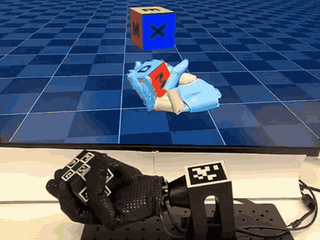
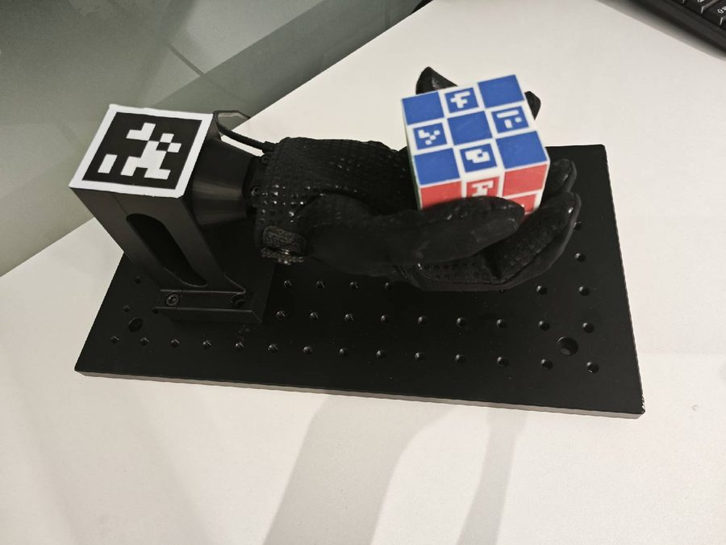

This guide covers the hardware-side setup for running the trained `WujiHand_Reorient` ONNX policy on a physical Wuji Hand. For the software pipeline, see [Sim-to-real Deployment](../sim2real).

By the end you'll have a calibrated camera, a 3D-printed ArUco cube, a wrist AprilTag world frame, a Wuji Hand on a fixture, and a populated `camera.yaml` and `cube_tags.json` for your rig.

<p align="center">
  
</p>

## Bill of Materials

<Callout type="info">
  The vision hardware (camera, lens, bracket) is a reference configuration. The functional requirement is that, after the camera intrinsics calibration, the chosen optics reliably estimate the cube pose relative to the wrist AprilTag across the reorient workspace. Any sensor and lens combination that meets that bar works. Treat the Hikrobot parts as a known-good starting point, not a hard requirement.
</Callout>

- **Industrial USB camera**: Hikrobot MV-CU013-A0UC (USB-3, 1280×1024, 1.3 MP, color Bayer GB), matching the sensor and capture format in [`camera.yaml`](https://github.com/wuji-technology/wuji-mjlab/blob/main/deploy/reorient/config/camera.yaml). Hikrobot is currently the only sensor SDK wired into the observer. UVC webcams and competitor industrial cameras require rewriting the cube observer to swap `MvImport` for the vendor's Python binding.
- **FA lens**: Hikrobot MVL-MF0824M-5MPE, 8 mm fixed focal length, F2.4, 2/3″ image circle, C-mount, 5 MP rated. Any 2/3″ image-circle C-mount lens with 8 mm focal length and F2.4 or wider aperture works equivalently.
- **Camera mounting bracket or tripod**: any rigid fixture that holds the camera ~350 mm above the palm with no creep between calibration and rollout. Vertical reach ≥ 400 mm, vibration-damped, fixed-height clamp preferred over servo-actuated arms.
- **Wrist AprilTag sticker**: 1 × AprilTag36h11 ID 0 with a 48 mm black-border edge, plus a quiet-zone white margin around it (see Wrist AprilTag for the exact dimension convention). Print on matte vinyl or laminated paper to avoid glare, black ink on white. Verify the printed black-border edge with a caliper before mounting — any scaling error propagates directly into pose estimation. See Wrist AprilTag for the print workflow.
- **Wuji Hand (right hand)**: contact Wuji Technology directly. The Wuji Hand SDK expects the firmware revision matching the deploy driver. The host connects over a single USB cable.
- **Hand mounting jig**: a 3D-printed PLA base bolted to an aluminum honeycomb breadboard. BOM and assembly in Physical Assembly. CAD ships with the release attachment.
- **Instrumented cube**: a 3D-printed 54 mm edge solid with 24 ArUco tags baked into the faces, matching `cube_tags.json`. Fabrication in Cube Fabrication. CAD ships with the release attachment.
- **Computer**: Ubuntu 22.04 x86_64, NVIDIA sm_80+ GPU (Ampere or newer), CUDA 12.8, at least 2 free USB ports.

<Callout type="info">
  All Wuji-fabricated parts (cube, jig) are open source under Apache 2.0. Commercial alternatives work as long as the cube edge is 54 mm and tag sizes match [`cube_tags.json`](https://github.com/wuji-technology/wuji-mjlab/blob/main/deploy/reorient/config/cube_tags.json).
</Callout>

## Software Prerequisites

### OS and GPU Drivers

- Ubuntu 22.04 LTS, x86_64
- NVIDIA driver bundled with CUDA 12.8 (`nvidia-smi` should report it)
- [pixi](https://pixi.sh) ≥ 0.66 in your `$PATH`

### Hikvision MVS SDK

The camera calibration and cube observer scripts import `MvImport.MvCameraControl_class` from a system-level SDK install, not vendored in this repo.

**Where to get it**: [hikrobotics.com](https://www.hikrobotics.com) → Service & Support → Downloads → MVS Client → Linux x86_64.

**Recommended version**: MVS Client ≥ 4.6.0 for Linux. Older 4.5.x versions ship slightly different Python bindings and may break the imports.

**Install**. The exact package format varies by platform and MVS release, so always defer to the README bundled inside the SDK archive. Common cases:

```bash
# Ubuntu / Debian (the .deb is what hikrobotics.com offers today)
sudo apt install ./MVS-*.deb

# CentOS / RHEL
sudo rpm -i MVS-*.rpm
```

All of these place files under `/opt/MVS/` by default. After install you should have `/opt/MVS/lib/64/libMvCameraControl.so` (runtime library), `/opt/MVS/Samples/64/Python/MvImport/` (Python bindings), and `/opt/MVS/bin/MVS` (GUI for device discovery).

**System tuning** (required to sustain the capture rate configured in `camera.yaml`):

```bash
# USB-3 cameras: install udev rules and raise USB scheduling priority
sudo /opt/MVS/bin/set_usb_priority.sh
```

**Shell environment**. The MVS installer writes its exports to `/etc/profile.d/MVS_*.sh`, which only login shells load. Most terminal sessions are non-login, so the variables go silently missing and the Python binding throws a `TypeError` on import. Append the exports to your shell rc:

```bash
# bash
echo 'export MVCAM_COMMON_RUNENV=/opt/MVS/lib' >> ~/.bashrc
echo 'export LD_LIBRARY_PATH=/opt/MVS/lib/64:$LD_LIBRARY_PATH' >> ~/.bashrc
source ~/.bashrc
```

| Variable | Role |
|---|---|
| `MVCAM_COMMON_RUNENV` | Read by the Hikvision Python binding to locate `libMvCameraControl.so` |
| `LD_LIBRARY_PATH` | Dynamic linker search path, so the MVS shared libraries resolve their transitive dependencies |

**Verify the install**:

```bash
# Python binding import test
python3 -c "import sys; sys.path.insert(0, '/opt/MVS/Samples/64/Python'); from MvImport.MvCameraControl_class import *; print('ok')"

# Hardware detection — your camera should appear in the left panel
/opt/MVS/bin/MVS
```

Common issues:

- `ModuleNotFoundError: MvImport` — the SDK path is wrong. Reinstall to `/opt/MVS/` or set `MVS_PYTHON_PATH=/path/to/MVS/Samples/64/Python`.
- `TypeError` on `MvCameraControl_class` import — `MVCAM_COMMON_RUNENV` is unset. See the shell environment step above.
- GUI lists no camera — re-run `set_usb_priority.sh`, check the cable, add your user to the `plugdev` and `dialout` groups, and confirm visibility with `lsusb`.

### Deploy Environment

Install the deploy environment from the repo root:

```bash
pixi install -e deploy
```

This pulls in OpenCV (ArUco and IPPE), pupil-apriltags (wrist tag), pyzmq (cube and goal pub-sub), glfw (passive MuJoCo viewer), the Wuji Hand SDK, and pyyaml. Smoke-test:

```bash
pixi run -e deploy python -c "import cv2, pupil_apriltags, zmq, wujihandpy; print(cv2.__version__)"
```

## Cube Fabrication

The fastest path reproduces the reference cube from the release-bundled assets. Download the release zip (see [Introduction](../introduction) for the `gh` command), which produces a `release-assets/` directory containing `hardware/cube/` with the `.3mf`, `.step`, `.obj`, and `.png` files. The cube is a 54 mm edge solid with 4 × 13 mm ArUco tags per face (24 tags total, IDs 0–23). Real performance depends on dimensions matching `cube_tags.json` to within ~0.5 mm.

To verify the 24-tag layout in 3D before printing:

```bash
pixi run python deploy/reorient/tools/view_release_cube.py
```

### 3D-Printing the Cube

Use the shipped Bambu Lab `.3mf` at `release-assets/hardware/cube/cube.3mf`. It contains the cube geometry plus the dual-material assignments that print the 24 ArUco tag patterns directly into the faces — no stickers, no glue, no alignment fuss.

1. Open the file in Bambu Studio, or drag it onto a connected Bambu printer.
2. Load two filaments, one black and one white (PLA is fine). The slicer prompts for slot assignment. The `.3mf` declares which logical slot is tag versus base — confirm the physical filaments match.
3. Slice and print. Default settings (~0.2 mm layer, ~30% infill) work.

Expected geometry (matches `cube_tags.json`, do not rescale): 54 mm cube edge, 13 mm tag tiles, tags centered 18 mm from face center along each face's local u and v axes.

<Callout type="warning">
  Multi-material prints are more failure-prone than single-material. Expect a couple of throw-away first prints while you dial in AMS flushing volume and inter-color purge.
</Callout>

**Single-material fallback**. Without a dual-material printer, produce a functional cube from `cube.step` plus printed stickers:

1. Print the cube body in any single material from `cube.step`. Verify the 54 mm edge with a caliper.
2. Print `cube.png` on matte vinyl or laminated paper at the exact UV-mapped size. Cut along face boundaries to get six 54 × 54 mm decals.
3. Apply each decal to its face. Tag IDs encode the face, so match the `cube_tags.json` mapping when placing decals.
4. Recalibrate `tag_center_offset` in `cube_tags.json` if your decals don't sit exactly 18 mm from the face center.

Stickered cubes are functionally equivalent at the ArUco-detection level but more prone to peeling and alignment errors. Prefer the `.3mf` if available.

<Callout type="info">
  The 6-color face background in `cube.png` and `cube.3mf` is a visual aid to tell faces apart by eye. The detector reads only the black-and-white tag patterns, and the observer applies a grayscale that collapses any colored background to near-zero. If you stickerize, a plain white background works as long as the tag pattern is high-contrast black on white.
</Callout>

### Tag Specifications

From `cube_tags.json` (vision-only, change only if your printed cube uses different geometry): ArUco 4×4 dictionary (`DICT_4X4_50`), `tag_size` 13 mm, `tag_center_offset` 18 mm from face center. Per-face tag IDs (T/R/B/L are the top, right, bottom, and left slots within a face):

| Face | T | R | B | L |
|---|---|---|---|---|
| TOP | 0 | 2 | 3 | 1 |
| BOTTOM | 11 | 9 | 8 | 10 |
| FRONT | 22 | 23 | 21 | 20 |
| BACK | 18 | 19 | 17 | 16 |
| LEFT | 14 | 15 | 13 | 12 |
| RIGHT | 5 | 4 | 6 | 7 |

## Wrist AprilTag

The cube observer defines the world (wrist) frame from a single AprilTag36h11 marker rigidly mounted to the wrist plate. Required specs: family AprilTag36h11, ID 0, edge 48 mm. Print at exactly 48 mm × 48 mm outer — the AprilTag library uses this as the metric scale, so printing scale errors propagate into pose estimation.

The tag plane sits on the back of the wrist, perpendicular to the palm normal. Mount it at the same orientation as the reference rig shown below.



<Callout type="warning">
  Don't move the wrist tag after world-frame sampling. The observer averages 100 frames on startup, then freezes the world pose. Any later shift corrupts the cube-in-tag observation the policy reads.
</Callout>

### Print or Buy

The factory hardware kit does not include a pre-cut wrist sticker. DIY printing is the recommended path, because vendors rarely offer single-tag custom sizes and you only need ID 0 at exactly 48 mm.

**Dimension convention**. AprilTag36h11 tiles have a 10 × 10 cell grid. The 48 mm spec is the outer edge of the black border, which is what the detector treats as `tag_size`. The white quiet zone (≥ 1 cell ≈ 4.8 mm) sits outside the 48 mm. A correctly printed sticker is ~58 mm × 58 mm total.

**DIY print workflow**:

1. **Source the tag image** from [`AprilRobotics/apriltag-imgs`](https://github.com/AprilRobotics/apriltag-imgs). ID 0 of family 36h11 is `tag36h11/tag36_11_00000.png`. The same repo's `tag_to_svg.py` produces a vector version at any size:

   ```bash
   git clone https://github.com/AprilRobotics/apriltag-imgs
   cd apriltag-imgs
   python3 tag_to_svg.py tag36h11/tag36_11_00000.png tag36_11_00000.svg --size=48mm
   ```

2. **Scale without antialiasing** if you stay with the PNG. Upscale using nearest-neighbor interpolation — antialiased edges blur the corner gradient and degrade pose estimation.
3. **Lay out with a quiet zone**. Place the 48 mm tile on a white page with ≥ 5 mm of pure white margin on all four sides.
4. **Print** at ≥ 600 dpi on matte vinyl or laminated matte paper, black toner on white. Avoid glossy stock.
5. **Verify with a caliper**. Measure the black square's outer edge and confirm 48.0 ± 0.3 mm on both axes.
6. **Mount** on the wrist plate at the orientation shown above. Re-read the warning before re-running the vision pipeline.

## Physical Assembly

### Hand Mounting

The Wuji Hand sits on a 3D-printed jig bolted to an aluminum honeycomb breadboard. The jig exposes the wrist AprilTag to the camera and gives the cube ~20 cm of clear space above the palm. Route the Hand's USB cable behind the wrist, out of the camera's field of view.


The release attachment's `hardware/hand-jig/` directory ships `assembly.pdf` (the dimensioned drawing), `assembly.step` (the full solid), and `base.3mf` (the printable base). If you reproduce from scratch, these are the key numbers off the drawing:

| Dimension | Value |
|---|---|
| Assembled height (base + breadboard) | 146.7 mm |
| Hand back-tilt at rest | 10.0° |
| Breadboard | 350 × 200 × 13 mm, AL6061-T6, anodized black |
| Breadboard hole grid | 91 × M6 tapped through-holes, 25 mm pitch, 13 × 7 array |
| 3D-printed base bounding box | ~90 (W) × 93 (D) × 134 (H) mm |
| Base → breadboard fixing | 4 × M6 socket-head screws through φ6.60 clearance holes with φ11.0 counterbores |

**Assembly**:

1. Print `base.3mf` on a PLA-capable FDM printer. The Bambu Lab profile is bundled in the file.
2. Place the base on the breadboard with the wrist-mount cradle facing forward. The base has four through-holes and counterbores aligned with the M6 thread grid.
3. Bolt the base down with four M6 socket-head screws.
4. The assembled stack is about 147 mm tall and tilts the Wuji Hand back by 10° so the wrist tag faces the camera at rest.
5. Strap the Wuji Hand into the cradle. Route the USB cable behind the wrist, out of camera view.

<Callout type="info">
  Functionally, only the 10° back-tilt and the counterbore pattern matter for camera framing and a flush bolt-down. The rest of the drawing is reproduction convenience.
</Callout>

### Camera Mounting

Mount the camera so the cube's reachable workspace and the wrist AprilTag both stay inside the preview throughout reorientation. In practice this is roughly 30–40 cm above the palm, but the exact distance is not critical — the policy keeps the cube within ~10 cm of palm center, so the workspace box is small and never leaves the frame mid-episode.

Don't hand-edit `fast_roi` in `camera.yaml`. The vision program ships an interactive selector. With the camera mounted:

```bash
pixi run -e deploy vision
```

In the preview window, press **`s`** to open the ROI dialog. Drag a rectangle around the cube's reachable workspace, then press ENTER or SPACE to confirm. The observer snaps the ROI to multiples of 8, writes it to `camera.yaml` atomically, and applies it live without restarting capture.

Other vision-window hotkeys:

| Key | Action |
|---|---|
| `s` | Open the ROI selector |
| `w` | Resample the world frame (re-detects the wrist AprilTag, resets cube filters) |
| `r` | Reset cube filters only |
| `q` | Quit |

### Lighting

Use diffuse ambient light. Avoid backlighting — the observer uses a min-channel grayscale, so washed-out tag edges are the biggest cause of detection dropouts. Leave CLAHE on in [`observer.yaml`](https://github.com/wuji-technology/wuji-mjlab/blob/main/deploy/reorient/config/observer.yaml). If cube faces look noisy under CLAHE, disable it and rely on min-channel only.

## Camera Intrinsics Calibration

The focal length, principal point, and distortion coefficients in `camera.yaml` describe the reference rig. For a different camera you must recalibrate before trusting any cube pose — a 5% focal-length error propagates linearly to cube position.

### Print the Chessboard

Print an 11 × 8 inner-corner board (12 × 9 squares) with 20 mm squares to match the calibrator's `SQUARE_SIZE` constant. Mount on rigid flat backing — bowing introduces a systematic radial bias.

### Run the Guided Calibrator

```bash
pixi run -e deploy python deploy/reorient/tools/camera_calibrate.py
```

The tool walks through 14 capture tasks (center, left, right, top, bottom regions, near, mid, far distance, straight, tilted attitude) and auto-captures when the region, size, and tilt are in range.

Keys: `c` force-capture, `n` skip, `s` fit (needs ≥ 12 captures), `q` quit. After `s`, the tool prints the RMS reprojection error and writes `camera_calibration.npz`. Aim for RMS < 0.5 px. Above 1.0 px indicates board motion or out-of-focus capture.

### Populate camera.yaml

The calibrator writes `camera_calibration.npz` but does not update `camera.yaml` in place. Copy the printed `K` and `dist` values into the `intrinsics` and `distortion` blocks by hand. Diff against the shipped file to confirm all 9 numbers are populated.

### Sanity Check

Run `pixi run -e deploy vision` in preview mode. The wrist-tag pose should hold steady to sub-pixel jitter when held still. Frequent PnP rejections mean the intrinsics are under-fit — return to Run the Guided Calibrator and capture more tilted samples.

With the rig calibrated, continue to [Sim-to-real Deployment](../sim2real) for pose tuning, the closed-loop run, and the end-to-end smoke test.
