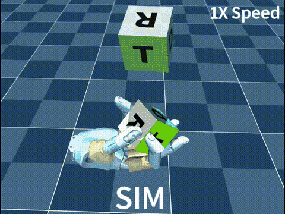
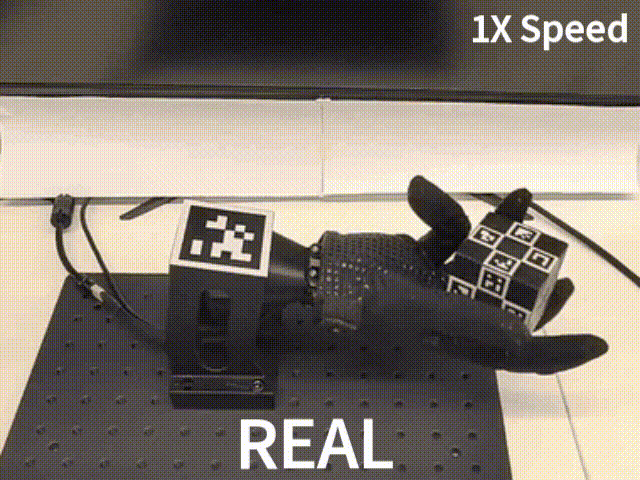

wuji-mjlab is an in-hand cube reorientation reinforcement learning project for the Wuji Hand. It trains PPO policies in [mjlab](https://github.com/mujocolab/mjlab) that cover the full SO(3) goal space, then deploys them on the physical hand through a sim-to-real bridge. The project ships pretrained checkpoints, deployment scripts, and hardware guides so you can reproduce the demo end to end.

<Callout type="info">
  This release targets the Wuji Hand (first generation). The deploy bridge wraps the Wuji Hand SDK and expects the matching firmware revision.
</Callout>

<div style={{ display: 'flex', gap: '2%', justifyContent: 'center', flexWrap: 'nowrap' }}>
  
  
</div>

## Task

The project centers on one task, with two training configurations.

| Robot | Task ID | Pretrained checkpoint | Demo |
|---|---|---|---|
| Wuji Hand | `WujiHand_Reorient` | [Latest release assets](https://github.com/wuji-technology/wuji-mjlab/releases/latest) | Sim and real demos above |

The policy holds a cube in a downward-facing hand, receives a target orientation in the palm frame, and rotates the cube in place until its orientation matches the goal within a hold window, without dropping it.

## What You Get

- A calibrated pipeline that runs the trained ONNX policy on real Wuji Hand hardware
- Pretrained checkpoints and released policy assets, so you can deploy without training
- A 3D-printed ArUco-tagged cube, wrist AprilTag world frame, and camera calibration workflow
- Two training configurations: a release config that reproduces the demo, and a lower-VRAM variant

## Get the Released Assets

Pull the pretrained checkpoint and CAD bundle from the latest release:

```bash
# Requires the GitHub CLI (https://cli.github.com). The glob keeps this
# command working unchanged across future release tags.
gh release download --repo wuji-technology/wuji-mjlab --pattern '*-assets.zip'
unzip wuji-mjlab-*-assets.zip
mv wuji-mjlab-*-assets release-assets
```

Without the `gh` CLI, open the [latest release page](https://github.com/wuji-technology/wuji-mjlab/releases/latest), download the `wuji-mjlab-v*-assets.zip` attachment by hand, then run the same `unzip` and `mv` pair.
