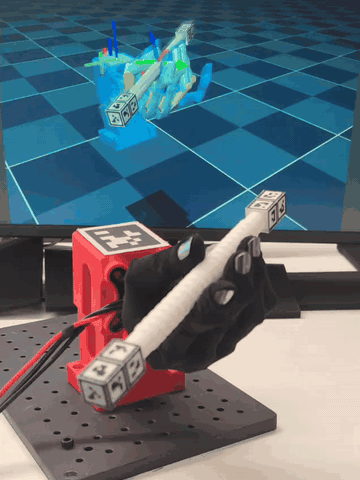
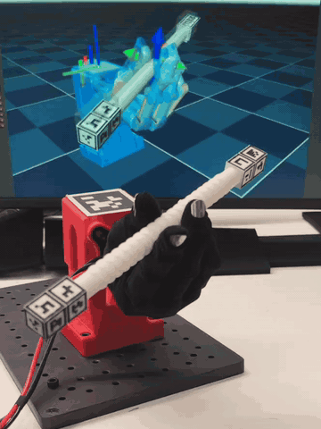
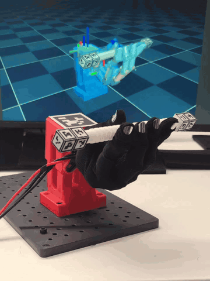
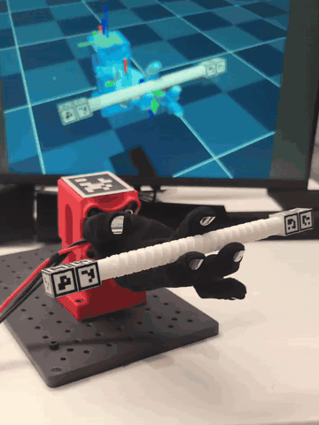
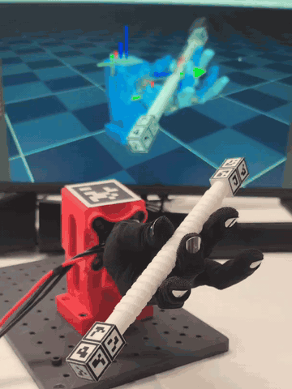

# 转笔

[English](README.md) · [项目首页](../../../../README_zh.md)

> Wuji Hand 2 固定腕转笔：基于 mjlab 和 PPO 训练参考动作跟踪策略，以 50 Hz 控制 20 个手指关节，并通过相机观测在真机上闭环执行。

[硬件搭建](docs/setup_zh.md) · [训练](docs/train_zh.md) · [部署](docs/deploy_zh.md)

## 动作展示

  &nbsp;
  &nbsp;
  &nbsp;
  &nbsp;
  

从左到右：第 1–5 组 · 点击放大动图

