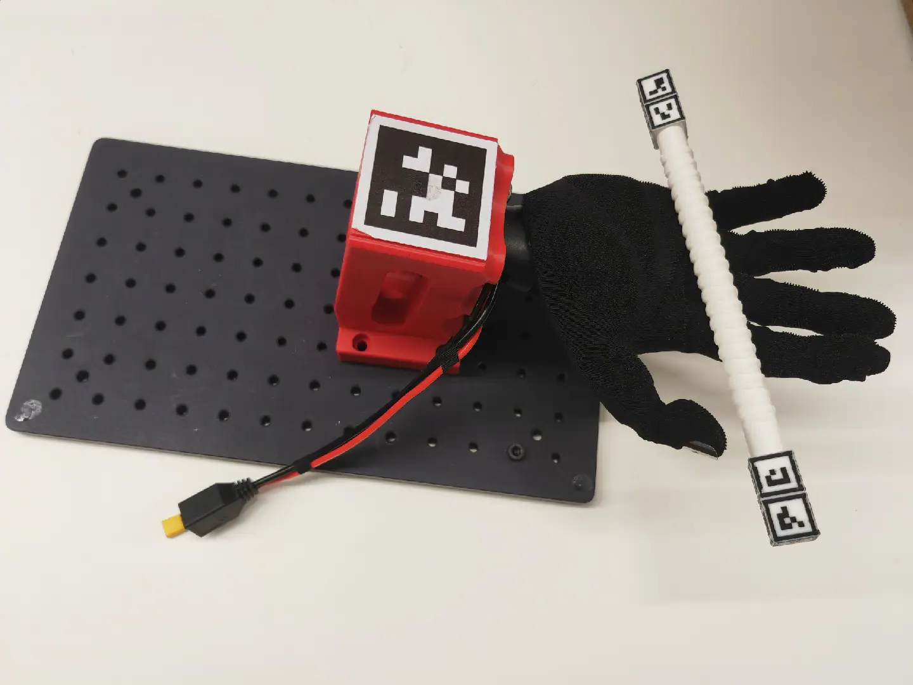
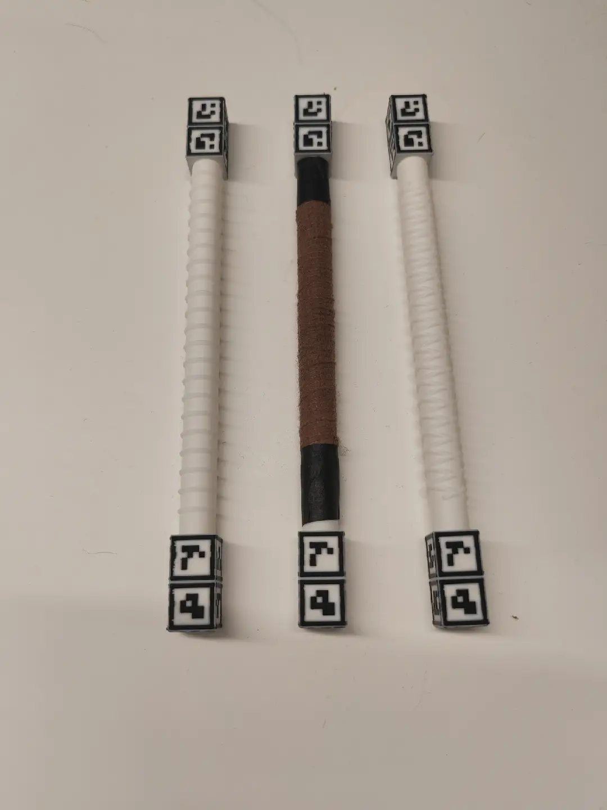
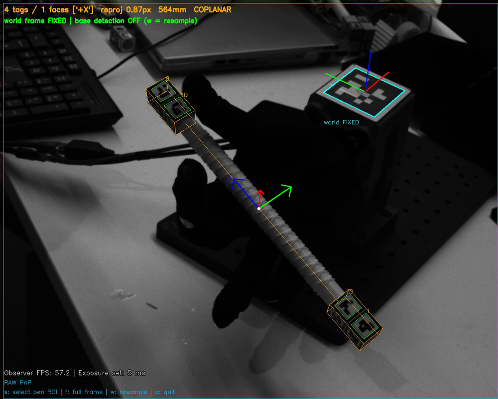

# 转笔 · 硬件搭建

[English](setup.md) · [任务首页](../README_zh.md) · [硬件搭建](setup_zh.md) · [训练](train_zh.md) · [部署](deploy_zh.md)

## 硬件资源

| 资源 | 获取位置 |
| --- | --- |
| 两种笔身、端部与完整装配 STEP | [合并资源包](https://github.com/wuji-technology/wuji-mjlab/releases/download/v2026.9.27/wuji-mjlab-v2026.9.27-assets.zip) · `pen_spin/hardware/` |
| 打印工程与装配 CAD | `pen_spin/hardware/` 下的 `pen_heads.3mf`、`pen_shafts.3mf`、`pen_assembly.step` |
| Wuji Hand 2 共享工装 | 同一资源包的 `hardware/hand2/` |
| 笔标签配置 | [pen_tags.json](../../../../../deploy/pen_spin/config/pen_tags.json) |
| 笔表面贴图 | [textures](../../../assets/objects/aruco_pen250/textures/) |
| 笔身与胶带处理示例 | [实物照片](images/pen-body-friction-options.webp) |
| 手、腕部标签、支架与笔 | [装配实物照片](images/hand-pen-assembly.webp) |

资源包根目录的 `hardware/` 存放共享工装，`reorient/` 和 `pen_spin/` 存放各任务资源；Wuji Hand 2 工装由两个任务共用。数据集见[训练文档](train_zh.md)，策略模型见[部署文档](deploy_zh.md)。

## 1. 装置概览

准备 Wuji Hand 2 右手、固定支架与底板、250 mm 标签笔、腕部 AprilTag、Hikrobot 相机与镜头，以及部署电脑和连接线缆。下图展示手、支架、腕部标签与笔的实物关系；相机不在这张照片内。

<p align="center">
  
</p>

相机需要同时覆盖笔的运动范围，并能在建立世界坐标时看到腕部标签。固定手和支架，整理线缆，避免遮挡标签或限制手指运动。

## 2. 软件环境

在仓库根目录安装独立的部署环境：

```bash
pixi install -e pen-spin-deploy
```

工业相机需要厂商的 MVS SDK。安装及环境变量设置可参照[相机 SDK 安装说明](../../reorient/docs/setup_zh.md#22-hikrobot-mvs-sdk)，具体步骤以所安装版本自带的说明为准。相机配置见 [`camera.yaml`](../../../../../deploy/pen_spin/config/camera.yaml)，策略控制配置见 [`control.yaml`](../../../../../deploy/pen_spin/config/control.yaml)。

## 3. 标签笔

我们提供**环纹**和**交叉螺旋纹**两种笔身设计。除了使用这两种笔身，也可以在笔身握持区域缠绕胶带，增大摩擦。缠绕时保持两端标签露出。

<p align="center">
  
</p>

每支笔使用一种笔身和两个不同的端部方柱。完整装配长 **250 mm**；独立笔杆长 **238 mm**，装配后外露段长 **178 mm**；两个端部方柱均为 **18 × 18 × 36 mm**。带凸纹笔身的外包直径约为 **16.9 mm**，区别于跟踪模型使用的光滑杆芯直径。

资源包 `pen_spin/hardware/` 下的文件对应关系：

| 文件 | 用途 |
|---|---|
| `assembly_ring_250mm.step` | 环纹版完整装配 |
| `assembly_cross_250mm.step` | 交叉螺旋纹版完整装配 |
| `shaft_ring_250mm.step`、`shaft_cross_250mm.step` | 两种可选笔身 |
| `end_block_1.step`、`end_block_2.step` | 每支笔各使用一个的端部方柱 |

上述环纹/交叉纹 STEP 文件名中的 250 mm 指整笔装配长度。同一目录还提供 `pen_heads.3mf`、`pen_shafts.3mf` 和 `pen_assembly.step`，打印几何以对应 3MF 为准。

打印工程配置为 Bambu Lab X2D、0.4 mm 喷嘴、Bambu PLA Basic、0.2 mm 层高、2 层墙、15% 网格填充，自动支撑未启用。耗材槽为白色和黑色，图案使用第二个耗材槽。笔头工程包含 1 个“长方柱1”和 3 个“长方柱2”；每支笔使用两种笔头各一个，打印前调整数量，并选择一种笔杆。

### 标签图案与布局

笔使用自定义的 **`SOURCE_1X2_18`** 字典，共 18 个图案。它们的 ID 不是标准 ArUco 字典中的编号，不能按相同数字生成普通标签替代。

[`pen_tags.json`](../../../../../deploy/pen_spin/config/pen_tags.json) 包含图案定义、标签角点和三维位置；[贴图目录](../../../assets/objects/aruco_pen250/textures/)包含 10 张图案贴图和 1 张空白贴图。资源包的标签素材位于 `pen_spin/hardware/tags/`：`textures/` 保留 10 张图案贴图，`texture_faces.csv` 记录各面的打印尺寸，`pen_tags.json` 提供标签位置。

原 PNG 为方形纹理，长侧面实际为 18 × 36 mm 或 36 × 18 mm，不能把每张 PNG 都直接打印成正方形。粘贴时保持各面图案、朝向和尺寸与配置一致。各面尺寸见 `pen_spin/hardware/tags/texture_faces.csv`，标签位置见同目录的 `pen_tags.json`。

## 4. 腕部标签与安装方向

腕部使用 **AprilTag36h11，ID 0，黑色检测外框边长 50.4 mm**。完整图像的白边不计入这个尺寸。常量及标签到手腕的变换见 [`tag_frame.py`](../../../../../deploy/pen_spin/lib/tag_frame.py)。

按上方装配照片固定标签、手和支架。若改变标签与手腕之间的相对位置或方向，应重新核对对应变换；不能只移动标签而继续使用原来的标定。建立世界坐标后保持装置固定。

## 5. 相机摆位与光照

采用能够看到多个笔标签面的斜视角，让笔的完整运动范围处于画面内。避免手指、支架和线缆长期遮挡标签；调节对焦、曝光和补光，使运动中的图案仍然清晰。

<p align="center">
  
</p>

这是观测窗口参考图。`1 faces / COPLANAR` 表示只看到一个共面标签面，可调整相机角度改善几何约束。检查叠加线框是否贴合实物，坐标轴是否跟随笔运动。

## 6. 相机标定与观测检查

[`camera.yaml`](../../../../../deploy/pen_spin/config/camera.yaml) 中的内参和畸变应对应实际相机、镜头及采集配置，不要直接把参考数值当成自己设备的标定结果。标定板和内参填写方法可参照[相机内参标定](../../reorient/docs/setup_zh.md#6-相机内参标定)，将结果填入转笔自己的配置文件。

先启动观测程序：

```bash
pixi run -e pen-spin-deploy pen-observer --preview
```

保持腕部标签可见，完成世界坐标采样。缓慢移动和转动笔，确认笔轴、头尾、位置和线框一致，且没有持续丢帧、跳变或翻转。移动相机或装置后，按 `w` 重新采样并再次检查。

## 7. 开始运行

硬件与观测核对完成后，按[部署文档](deploy_zh.md#启动相机与策略)先启动相机观测，待观测就绪后运行 `pen-policy`；该命令默认同时启动真机控制和实时镜像窗口，无需另外打开 `pen-sim`。选择同一动作组的策略与参考轨迹；模型和数据下载见[部署](deploy_zh.md)和[训练](train_zh.md)。
