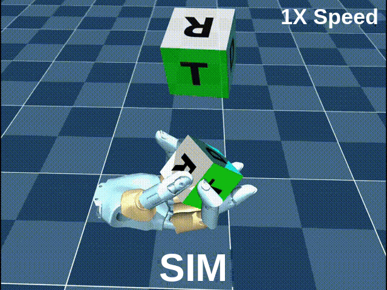
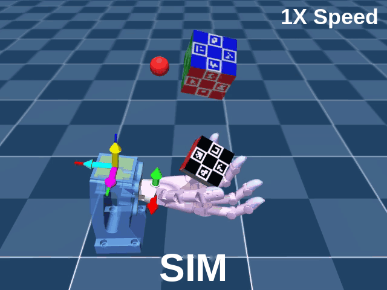
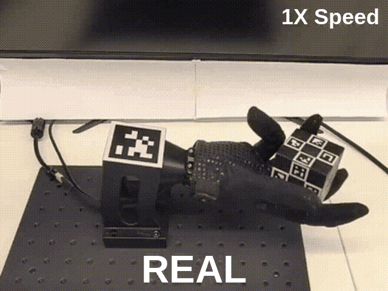
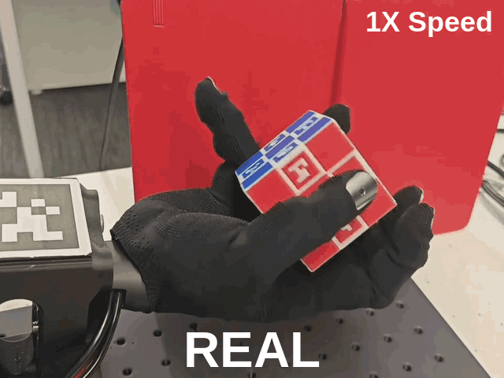

# Cube Reorientation

[中文版](README_zh.md) · [Project home](../../../../README.md)

> Rotate a cube held palm-up to a target SO(3) orientation, maintaining that orientation for a hold window without dropping it. Supports both generations of the right Wuji Hand.

[Setup](docs/setup.md) · [Train](docs/train.md) · [Deploy](docs/deploy.md)

## Motion showcase

<table width="100%">
  <tr>
    <th width="50%">Wuji Hand 1</th>
    <th width="50%">Wuji Hand 2</th>
  </tr>
  <tr>
    <td valign="top"></td>
    <td valign="top"></td>
  </tr>
  <tr>
    <td valign="top"></td>
    <td valign="top"></td>
  </tr>
</table>

Left: Wuji Hand 1. Right: Wuji Hand 2. SIM above REAL · Click to enlarge

