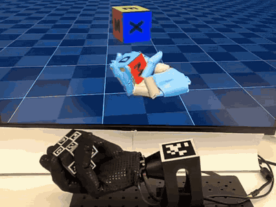
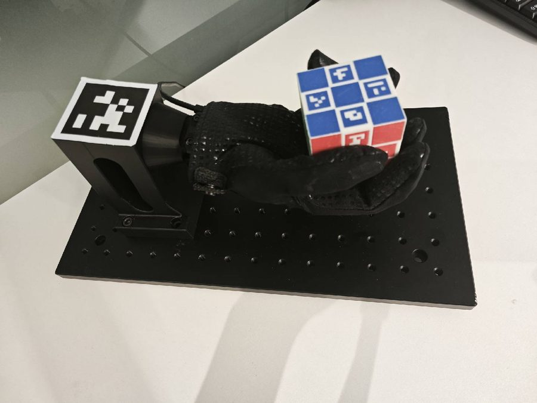

# 方块翻转 · 硬件搭建

[English](setup.md) · [任务首页](../README_zh.md) · [硬件搭建](setup_zh.md) · [训练](train_zh.md) · [部署](deploy_zh.md)

## 硬件资源

| 资源 | 下载链接 | 包内位置 |
|---|---|---|
| 方块模型、打印文件与纹理 | [合并资源包](https://github.com/wuji-technology/wuji-mjlab/releases/download/v2026.9.27/wuji-mjlab-v2026.9.27-assets.zip) | `reorient/hardware/` |
| Wuji Hand 1 治具 | [合并资源包](https://github.com/wuji-technology/wuji-mjlab/releases/download/v2026.9.27/wuji-mjlab-v2026.9.27-assets.zip) | `hardware/hand1/` |
| Wuji Hand 2 治具 | [合并资源包](https://github.com/wuji-technology/wuji-mjlab/releases/download/v2026.9.27/wuji-mjlab-v2026.9.27-assets.zip) | `hardware/hand2/` |

以下详细搭建参数基于 Wuji Hand 1 参考装置。共享工装位于资源包根目录，Wuji Hand 1 和 Wuji Hand 2 治具分别位于 `hardware/hand1/` 和 `hardware/hand2/`，其中Wuji Hand 2 工装供转方块和转笔共用；Wuji Hand 2 请使用自己的装配图和底座，不要套用下文的 Wuji Hand 1 尺寸。策略下载见[部署文档](deploy_zh.md)。

<p align="center">
  
</p>

## 1. 物料清单

以下清单对应参考装置。可以使用其他厂商的同规格部件，但需要通过第 3 节和第 5 节的几何核对。

> 相机、镜头和支架仅为参考配置。实际要求是：完成第 6 节内参标定后，在方块整个可达运动范围内，能够稳定估计方块相对腕部 AprilTag 的位姿。

- **工业 USB 相机**：Hikrobot **MV-CU013-A0UC**，USB 3、1280 × 1024、130 万像素、Bayer GB 彩色格式，与 [`camera.yaml`](../../../../../deploy/reorient/config/camera.yaml) 的传感器及采集格式匹配。观测程序直接导入 `MvImport.MvCameraControl_class`；改用其他品牌时，需要在 [`cube_world_observer.py`](../../../../../deploy/reorient/scripts/cube_world_observer.py) 中接入对应的 Python SDK。MVS SDK 安装见第 2.2 节。
- **工业镜头**：Hikrobot **MVL-MF0824M-5MPE**，8 mm 定焦、F2.4、2/3 英寸靶面、C 接口、500 万像素。替代镜头应具有相同靶面和接口、8 mm 焦距，以及 F2.4 或更大的光圈。
- **相机支架或三脚架**：将相机固定在掌心上方约 350 mm，标定和运行期间保持位置不变。使用 1/4 英寸 20 牙标准三脚架接口或合适的固定支架，垂直行程至少 400 mm。支架不应因 USB 线缆拉力弯曲，应抑制振动；优先使用固定高度的夹持结构。
- **腕部 AprilTag**：AprilTag36h11，ID 0，检测尺寸 **50.4 mm**。该尺寸对应观测脚本中的 `WORLD_TAG_SIZE = 0.0504`，不能通过 YAML 修改。采用哑光材料，打印后用卡尺检查尺寸；打印缩放误差会直接影响位姿估计。尺寸定义和制作步骤见第 4 节。方块表面的 24 个 ArUco 图案由 `.3mf` 中的双色打印设计形成，见第 3.1 节。
- **Wuji Hand 右手**：向 Wuji Technology 获取。`wujihandpy==1.5.1` 对应 Wuji Hand 1 驱动 `wuji_reorient_deploy/drivers/hand1.py` 所需的固件版本。通过 USB 连接，设备提供 USB CDC 接口，STMicroelectronics 厂商 ID 为 `0483`。
- **手部安装治具**：PLA 打印底座，通过螺栓固定在铝合金蜂窝板上。物料和装配见第 5.1 节，CAD 见[发布资源](https://github.com/wuji-technology/wuji-mjlab/releases)。
- **标签方块**：边长 54 mm，六个面共 24 个 ArUco 标签，布局与 `cube_tags.json` 一致。制作见第 3 节，CAD 见[发布资源](https://github.com/wuji-technology/wuji-mjlab/releases)。
- **电脑**：Ubuntu 22.04 x86_64、NVIDIA sm_80 及以上架构 GPU（Ampere 或更新）、CUDA 12.8，至少两个可用 USB 接口，分别连接相机和手。

Wuji 提供的方块和治具设计按 Apache 2.0 开源。替代件应保持方块边长 54 mm，且标签尺寸与 [`cube_tags.json`](../../../../../deploy/reorient/config/cube_tags.json) 一致。

## 2. 软件前置条件

### 2.1 系统与显卡驱动

- Ubuntu 22.04 LTS，x86_64。
- 适配 CUDA 12.8 的 NVIDIA 驱动，通过 `nvidia-smi` 检查。
- [pixi](https://pixi.sh) ≥ 0.72，并已加入 `$PATH`。

### 2.2 Hikrobot MVS SDK

`tools/camera_calibrate.py` 和 `scripts/cube_world_observer.py` 从系统 SDK 导入 `MvImport.MvCameraControl_class`。

从 [Hikrobot 官网](https://www.hikrobotics.com)的服务支持、下载页面获取 Linux x86_64 版 MVS 客户端。参考环境使用 MVS Client ≥ 4.6.0；较早的 4.5.x 版本具有不同的 Python 绑定，可能无法直接导入。

**安装命令以 SDK 压缩包内的 README 为准。** 不同版本和发行版的安装方式可能不同，常见命令如下：

```bash
# Ubuntu / Debian：安装下载的 .deb 软件包
sudo apt install ./MVS-*.deb

# 或使用以下等效命令
sudo dpkg -i MVS-*.deb

# CentOS / RHEL
sudo rpm -i MVS-*.rpm

# 较旧版本的 tar 压缩包
tar -xf MVS-*.tar.gz && cd MVS-* && sudo ./setup.sh
```

默认安装位置为 `/opt/MVS/`。安装后检查：

- `/opt/MVS/lib/64/libMvCameraControl.so`：运行时共享库。
- `/opt/MVS/Samples/64/Python/MvImport/`：Python 绑定。
- `/opt/MVS/bin/MVS`：设备发现与实时预览程序。

为支持 `camera.yaml` 中的 90 FPS 采集配置，按相机接口执行相应系统设置：

```bash
# USB 3 相机：安装 udev 规则并提高 USB 调度优先级
sudo /opt/MVS/bin/set_usb_priority.sh

# 仅 GigE 相机：增加内核套接字缓冲，减少丢帧
sudo /opt/MVS/bin/set_socket_buffer_size.sh
```

安装器通常把环境变量写入 `/etc/profile.d/MVS_*.sh`，但该文件只由登录 shell 加载。普通终端中的 zsh 或 bash 可能没有这些变量，导入 SDK 时会报 `TypeError: unsupported operand type(s) for +: 'NoneType' and 'str'`。先在当前终端设置：

```bash
export MVCAM_COMMON_RUNENV=/opt/MVS/lib
export LD_LIBRARY_PATH="/opt/MVS/lib/64${LD_LIBRARY_PATH:+:$LD_LIBRARY_PATH}"
```

将这两行加入实际使用的 `~/.bashrc` 或 `~/.zshrc`，供新终端使用。已有旧安装目录时也需覆盖；`MVCAM_COMMON_RUNENV` 应指向 `lib/`，不是 `lib/64/`。

| 环境变量 | 用途 |
|---|---|
| `MVCAM_COMMON_RUNENV` | Python 绑定通过它查找 `libMvCameraControl.so`。 |
| `LD_LIBRARY_PATH` | Linux 动态链接器的共享库搜索路径，用于加载 MVS 及其依赖。 |

检查变量：

```bash
echo $MVCAM_COMMON_RUNENV          # /opt/MVS/lib
echo $LD_LIBRARY_PATH | tr ':' '\n' | grep MVS   # 应包含 /opt/MVS/lib/64
```

验证 Python 导入和设备识别：

```bash
# 检查 Python 绑定是否可以导入
python3 -c "import sys; sys.path.insert(0, '/opt/MVS/Samples/64/Python'); from MvImport.MvCameraControl_class import *; print('ok')"

# 检查设备识别：左侧面板中应出现相机
/opt/MVS/bin/MVS
```

常见问题：

- `ModuleNotFoundError: MvImport`：检查 SDK 路径，重新安装到 `/opt/MVS/`，或设置 `MVS_PYTHON_PATH=/path/to/MVS/Samples/64/Python`。
- 导入时出现上述 `NoneType` 错误：检查 `MVCAM_COMMON_RUNENV`，重新加载 shell 配置。
- 图形界面找不到相机：重新运行 `set_usb_priority.sh`，检查线缆和 `plugdev`、`dialout` 用户组；USB 相机可用 `lsusb | grep -i hikvis` 检查，GigE 相机可用 `arp -a | grep -i hikvis` 检查。

### 2.3 部署环境

在仓库根目录运行 `pixi install -e reorient-deploy`。依赖由 [`pixi.toml`](../../../../../pixi.toml) 的 `[feature.reorient-deploy.pypi-dependencies]` 定义，包括 `opencv-contrib-python>=4.13`（ArUco 和 IPPE）、`pupil-apriltags>=1.0`（腕部标签）、`pyzmq>=27.0`（位姿发布与订阅）、`glfw>=2.10`（MuJoCo 观察窗口）、`wujihandpy==1.5.1`（手部驱动）和 `pyyaml>=6.0`。

运行导入检查：

```bash
pixi run -e reorient-deploy python -c "import cv2, pupil_apriltags, zmq, wujihandpy; print(cv2.__version__)"
```

## 3. 方块制作

使用发布包中提供的方块模型可以直接复现参考几何。以下命令下载并解压 v2026.9.27 合并资源包：

```bash
# 需要 unzip；仅在尚无 wuji-mjlab-v2026.9.27-assets 目录时执行一次
# 需要 GitHub CLI：https://cli.github.com；下载指定版本的资源附件
gh release download v2026.9.27 --repo wuji-technology/wuji-mjlab --pattern 'wuji-mjlab-v2026.9.27-assets.zip'
unzip wuji-mjlab-v2026.9.27-assets.zip
```

解压后的 `reorient/hardware/` 提供方块文件；`hardware/hand1/` 和 `hardware/hand2/` 分别提供Wuji Hand 1 和 Wuji Hand 2 的治具。

方块边长 54 mm，每个面有 4 个约 13 mm 的 ArUco 标签，共 24 个，ID 为 0–23。打印前查看网格和标签布局：

```bash
pixi run -e reorient-deploy python deploy/reorient/tools/view_release_cube.py \
  --cube wuji-mjlab-v2026.9.27-assets/reorient/hardware/cube.obj
```

未安装 GitHub CLI 时，可在 [v2026.9.27 发布页](https://github.com/wuji-technology/wuji-mjlab/releases/tag/v2026.9.27)手动下载资源包，然后执行相同的解压步骤。

### 3.1 打印方块

使用发布包中的 **Bambu Lab `.3mf`**，路径为 `wuji-mjlab-v2026.9.27-assets/reorient/hardware/cube.3mf`。文件包含几何及黑白双色材料分配，可将 24 个 ArUco 4×4 图案直接打印到方块表面。

1. 在 **Bambu Studio** 中打开 `.3mf`。
2. 装入黑色和白色两种耗材，例如 PLA。检查 AMS 或外置料盘的分配，确保图案和底色对应正确的耗材。
3. 切片、打印并称量成品。

不要缩放模型：方块边长应为 **54 mm**，标签约 13 mm，标签中心沿每个面的局部 u、v 轴距面中心 18 mm，具体值见 [`cube_tags.json`](../../../../../deploy/reorient/config/cube_tags.json)。

各面标签编号：TOP 为 0–3，BOTTOM 为 8–11，FRONT 为 20–23，BACK 为 16–19，LEFT 为 12–15，RIGHT 为 4–7。

**单色打印替代方案**：

1. 用 `cube.step` 或 `cube.obj` 打印方块主体，材料可选 PLA、PETG 等，打印后用卡尺确认边长为 54 mm。
2. 将 `cube.png` 按 UV 展开的实际尺寸打印到哑光贴纸或覆哑光膜的纸上，沿六个面边界裁成 54 × 54 mm 的贴片。
3. 按 `cube_tags.json` 对应关系粘贴，每个面上的图案方向也必须一致，例如 ID 0–3 对应 TOP。
4. 如果标签中心距面中心不是 18 mm，应同步重新标定 `tag_center_offset`。

双色打印使用 `.3mf` 中的材料分配；贴纸方案需保持清晰的黑白对比。

### 3.2 标签规格

`cube_tags.json` 使用 **ArUco 4×4** 字典 `cv2.aruco.DICT_4X4_50`，`tag_size: 0.013`（13 mm），`tag_center_offset: 0.018`（18 mm）。这些是视觉几何参数，仅在实物几何改变时调整，不随策略重新训练而改变。

`face_rotations` 为 TOP 0°、BOTTOM 180°、FRONT/BACK/LEFT 90°、RIGHT 270°。

下表的 T、R、B、L 分别表示每个面内的上、右、下、左位置，对应 `faces_config`：

| 面 | T | R | B | L |
|---|---|---|---|---|
| TOP | 0 | 2 | 3 | 1 |
| BOTTOM | 11 | 9 | 8 | 10 |
| FRONT | 22 | 23 | 21 | 20 |
| BACK | 18 | 19 | 17 | 16 |
| LEFT | 14 | 15 | 13 | 12 |
| RIGHT | 5 | 4 | 6 | 7 |

### 3.3 各面的局部坐标轴

`.3mf` 中已包含标签。下表给出模型和 `cube_world_observer.py::_build_aruco_board` 共用的方块坐标约定。自行重新生成模型、改变边长或标签字典时，应同步更新两者。可按第 3 节运行 `view_release_cube.py` 查看布局。

| 面 | 中心方向（方块坐标系） | u 轴 | v 轴 |
|---|---|---|---|
| TOP | `[0,0,1]` | `[1,0,0]` | `[0,1,0]` |
| BOTTOM | `[0,0,-1]` | `[1,0,0]` | `[0,-1,0]` |
| FRONT | `[0,-1,0]` | `[1,0,0]` | `[0,0,1]` |
| BACK | `[0,1,0]` | `[-1,0,0]` | `[0,0,1]` |
| LEFT | `[-1,0,0]` | `[0,-1,0]` | `[0,0,1]` |
| RIGHT | `[1,0,0]` | `[0,1,0]` | `[0,0,1]` |

每面四个标签分别位于 u、v 方向的正负 `tag_center_offset` 处。标签的“上”应与该面的 v 轴一致。面内旋转错误会改变角点对应关系，导致位姿旋转错误，或因重投影误差过大而被 PnP 筛选拒绝。

## 4. 腕部 AprilTag

观测程序通过固定在腕部板上的一个 AprilTag36h11 标签建立世界坐标系。标签 **ID 为 0，检测尺寸为 50.4 mm**，对应 `WORLD_TAG_SIZE = 0.0504`。该尺寸决定位姿估计的尺度。

标签安装在腕背位置，标签平面垂直于掌心法向。`WORLD_FRAME_CORRECTION` 固定绕标签 X 轴旋转 180°，即 X 不变、Y 和 Z 取反，因此治具和标签方向应与参考装置一致。



> 世界坐标采样后不要移动腕部标签。观测程序启动时平均 100 帧并固定世界位姿（`_finalize_world_frame`），之后移动标签会使策略读取的方块相对位姿失准。

### 4.1 打印或购买标签

只需要 AprilTag36h11 的 ID 0。购买现成标签时，应核实检测尺寸是否为 50.4 mm。

**尺寸定义**：[AprilTag 的检测尺寸](https://github.com/AprilRobotics/apriltag#pose-estimation)是检测角点之间的距离，即黑色边框的外边长，不包含外围白色留白。36h11 官方图像由 10 × 10 个单元组成：中央 6 × 6 数据单元，四周各一格黑边，再各一格白色留白。黑色区域外框为 8 × 8 单元，50.4 mm 对应每格 6.3 mm，因此完整图像应为 **63 × 63 mm**，包含 6.3 mm 宽的外部白边。

**制作步骤**：

1. 从官方 [`AprilRobotics/apriltag-imgs`](https://github.com/AprilRobotics/apriltag-imgs) 获取 [`tag36h11/tag36_11_00000.png`](https://github.com/AprilRobotics/apriltag-imgs/blob/master/tag36h11/tag36_11_00000.png)。原始图为 10 × 10 像素，也可使用同仓库的脚本生成 SVG：

   ```bash
   # 从 wuji-mjlab 仓库根目录执行
   git clone https://github.com/AprilRobotics/apriltag-imgs
   cd apriltag-imgs
   pixi run --manifest-path ../pixi.toml python tag_to_svg.py tag36h11/tag36_11_00000.png tag36_11_00000.svg --size=63mm
   ```

2. 使用 PNG 时，采用**最近邻插值**放大，不要使用抗锯齿缩放，以免模糊检测边缘。例如：

   ```bash
   # 10 像素放大到 1488 像素（600 dpi 下约 63 mm），使用最近邻插值
   # 需要 ImageMagick 6；ImageMagick 7 使用 magick 替代 convert
   convert tag36h11/tag36_11_00000.png -filter point -resize 14880% tag_63mm_600dpi.png
   ```

   在 GIMP 或 Photoshop 中选择图像缩放，将插值设置为“无”或“最近邻”。
3. 保留完整 63 mm 图像及外部 6.3 mm 白边。以至少 600 dpi 打印到哑光材料上，保持黑白对比，避免反光。
4. 用卡尺测量黑色外框，两个方向都应为 50.4 mm，而不是测量最外侧白边。
5. 按图示方向固定到腕部板。世界坐标采样前核对实测尺寸与 `WORLD_TAG_SIZE` 一致。

完成标签制作后，返回仓库根目录再执行后续命令：

```bash
cd ..
```

## 5. 硬件装配

### 5.1 手部安装

将打印治具固定在铝合金蜂窝板上，再安装 Wuji Hand。保证腕部 AprilTag 面向相机，掌心上方留出约 20 cm 的方块运动空间，USB 线从腕后走线，避开相机视野。


**Wuji Hand 1 参考物料**：

| 编号 | 规格 | 部件 | 数量 | 材料 | 表面处理 | 获取方式 |
|---|---|---|---|---|---|---|
| 1 | 350 × 200 × 13 mm | 铝合金蜂窝板 | 1 | AL6061-T6（SS） | 黑色阳极氧化 | 购买标准件 |
| 2 | 见发布包 `base.3mf` | 打印底座 | 1 | PLA | — | 打印 |

另需 4 颗 M6 内六角圆柱头螺钉，长度按板厚确定，参考长度为 16 mm。蜂窝板采用 **25 mm 间距的 M6 螺纹通孔网格**，边距 25 mm，共 13 × 7 排列的 91 个孔。可选用相同孔网格的标准板，无需专门加工。

**装配顺序**：

1. 使用支持 PLA 的 FDM 打印机打印 `base.3mf`，文件内附 Bambu 打印配置。
2. 将底座放在蜂窝板上，腕部安装槽朝前。底座的 4 个 φ6.60 mm 通孔及 φ11 mm 沉孔对应板上的 M6 螺纹孔。
3. 通过沉孔装入 4 颗 M6 螺钉，将底座固定到板上。
4. Wuji Hand 1 参考装配高度约 147 mm，手向后倾斜 10°，使静止时的腕部标签朝向相机。
5. 将手固定到安装槽，线缆从腕后引出。

合并资源包的 `hardware/hand1/` 包含 `assembly.pdf`、`assembly.step` 和 `base.3mf`，分别用于查看尺寸、编辑完整 CAD 和打印底座。以下为原 Wuji Hand 1 图纸中的参考数值；Wuji Hand 2 使用合并包自己的 `hardware/hand2/assembly.pdf`。

| 项目 | Wuji Hand 1 参考值 |
|---|---|
| 装配高度（底座与蜂窝板） | 146.7 mm |
| 手部后倾角 | 10.0° |
| 图纸记录的总装配质量 | 约 14.3 kg，主要来自蜂窝板；实际成品需称量 |
| 蜂窝板 | 350 × 200 × 13 mm，AL6061-T6，黑色阳极氧化 |
| 孔网格 | 91 个 M6 螺纹通孔，25 mm 间距，13 × 7 排列 |
| 底座外包尺寸 | 约 90（宽）× 93（深）× 134（高）mm |
| 底座固定孔 | 4 个 φ6.60 通孔，φ11.0、深 6.8 的沉孔；另有 2 个 φ3.2 定位孔 |
| 底座打印配置 | PLA，0.2 mm 层高，3 层壁，50% 填充，0.4 mm 喷嘴；详见 `base.3mf` |

原图纸还注明未注公差按 GB/T1804-2000-F、未注表面粗糙度 Ra 3.2，以及去毛刺、倒角和 RoHS 2.0 / REACH 要求。加工时以所用代际的正式图纸为准；这些图纸标注不替代成品检验。相机布置尤其依赖后倾角和底座固定孔的位置。

### 5.2 相机安装

将相机固定在能够同时看到腕部标签和方块可达运动范围的位置。参考距离为掌心上方约 30–40 cm，实际以完整视野和清晰度为准。腕部标签至少应在世界坐标采样时可见。

观测程序提供交互式 ROI 选择，无需手动编辑 [`camera.yaml`](../../../../../deploy/reorient/config/camera.yaml) 的 `fast_roi`。启动预览：

```bash
pixi run -e reorient-deploy vision
```

按 `s`，框选**方块的可达运动范围**。该区域用于逐帧 ArUco 检测；腕部标签不必始终位于 ROI 内，但启动和按 `w` 重新采样时必须可见。按回车或空格确认，按 `C` 取消。

| 按键 | 功能 |
|---|---|
| `s` | 选择检测区域 |
| `w` | 重新检测腕部标签，采样世界坐标并重置方块滤波器 |
| `r` | 只重置方块滤波器，保留世界坐标 |
| `q` | 退出 |

每次启动 `vision` 都会对腕部标签平均 100 帧并固定世界位姿。重新安装治具、移动相机、改变焦距或 ROI，或观察到明显位姿漂移后，可按 `w` 重新采样。**不要在策略运行中重新采样**，避免突然改变策略使用的坐标系。

### 5.3 光照

使用均匀漫射光，避免逆光。默认保持 [`observer.yaml`](../../../../../deploy/reorient/config/observer.yaml) 中的 `enable_clahe: true`；若图像噪声明显增加，可关闭 CLAHE 后比较识别效果。

## 6. 相机内参标定

[`camera.yaml`](../../../../../deploy/reorient/config/camera.yaml) 中的 `fx`、`fy`、`cx`、`cy` 和五参数 Brown–Conrady 畸变对应参考相机。换用相机或镜头后，应重新标定。

### 6.1 准备棋盘格

标定板为 **11 × 8 个内角点**，即 12 × 9 个方格，每格边长 20 mm，对应 `SQUARE_SIZE = 0.020`。使用其他格长时同步修改常量。将棋盘格贴在平整刚性背板上，避免弯曲引入系统误差。

### 6.2 运行引导标定

```bash
pixi run -e reorient-deploy python deploy/reorient/tools/camera_calibrate.py
```

程序提供 14 个采集任务，覆盖画面中心与四周、近中远距离，以及正面和倾斜姿态。按 `c` 强制采集，`n` 跳过，`s` 拟合，`q` 退出。拟合至少需要 12 组图像。

按 `s` 后，程序输出 RMS 重投影误差，并写入 `deploy/reorient/config/camera_calibration.npz`。参考目标为 RMS < 0.5 px；超过 1.0 px 时应检查标定板是否移动、图像是否失焦。

### 6.3 填写相机配置

标定器不会直接修改 `camera.yaml`。将输出的 `K` 和 `dist` 手动填入 `intrinsics`、`distortion`，检查 `fx`、`fy`、`cx`、`cy`、`k1`、`k2`、`p1`、`p2`、`k3` 共 9 个数值。

### 6.4 验证标定

运行 `pixi run -e reorient-deploy vision`。静止时腕部标签位姿应保持稳定。观测器会拒绝平均重投影误差超过 6.0 px 的 PnP 结果（`observer.yaml::pnp.reproj_threshold`）；频繁拒绝时，应回到第 6.2 节增加倾斜姿态样本并重新拟合。

## 7. 位姿观测排查

硬件固定后，可通过 [`observer.yaml`](../../../../../deploy/reorient/config/observer.yaml) 的滤波参数平衡噪声和延迟：

- 静止方块抖动：降低 `process_noise` 和 `alpha`，或提高 `measurement_noise`。
- 快速翻转时位姿滞后：提高 `process_noise` 和 `alpha`，或降低 `measurement_noise`。
- 频繁丢失方块：检查第 6 节标定结果，可结合重投影误差将 `pnp.reproj_threshold` 调整至例如 8.0 px；坐标轴不一致时，检查 `face_rotations` 和标签粘贴方向。

## 8. 开始部署

硬件与标定完成后，按[部署文档](deploy_zh.md#wuji-hand-1-端到端验证)选择策略并完成端到端验证。

许可协议为 Apache 2.0，见仓库根目录的 [LICENSE](../../../../../LICENSE)。
